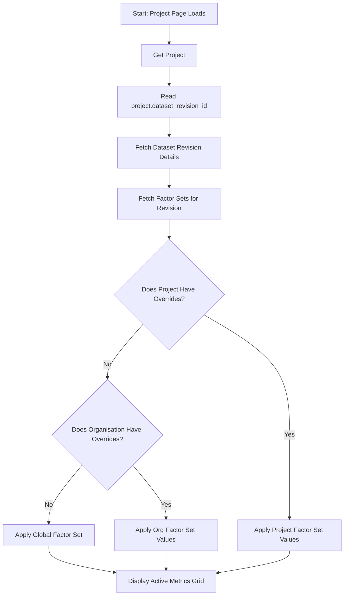

```mermaid
graph TD;
    A["Start: Project Page Loads"] --> B["Get Project"];
    B --> C["Read project.dataset_revision_id"];
    C --> D["Fetch Dataset Revision Details"];
    D --> E["Fetch Factor Sets for Revision"];
    E --> F{"Does Project Have Overrides?"};

    F -->|Yes| G["Apply Project Factor Set Values"];
    F -->|No| H{"Does Organisation Have Overrides?"};

    H -->|Yes| I["Apply Org Factor Set Values"];
    H -->|No| J["Apply Global Factor Set"];

    J --> K["Display Active Metrics Grid"];
    I --> K;
    G --> K;
```